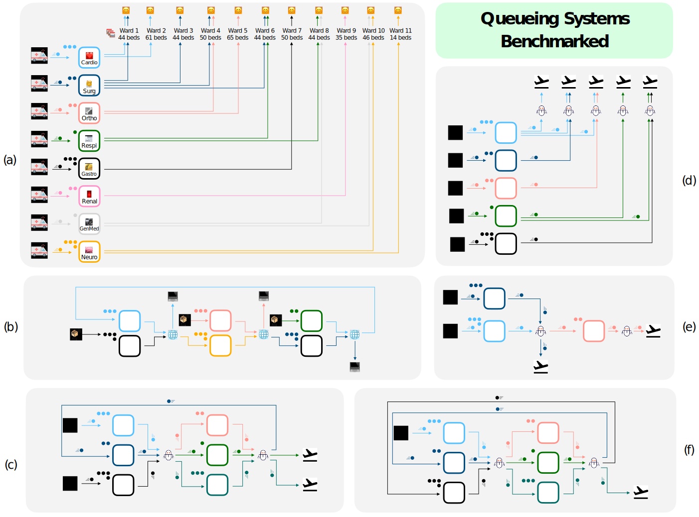

# QGym: Scalable Simulation and Benchmarking of Queuing Network Controllers
<a target="_blank" style="display: inline-block; vertical-align: middle" href="https://colab.research.google.com/drive/157MJ0AtqokMA8tOrOkJintQTQWMf26Je?usp=sharing">
  
</a>


## Table of Contents
- [Overview](#overview)
- [Highlights of QGym](#highlights-of-qgym)
- [File Structure](#file-structure)
- [Use as an OpenAI Gym Environment](#use-as-an-openai-gym-environment)
  - [Usage](#usage)
  - [API Reference for `DiffDiscreteEventSystem(gym.Env)`](#api-reference-for-diffdiscreteeventsystemgymenv)
    - [Parameters](#parameters)
    - [Methods](#methods)
- [How to Run Experiments](#how-to-run-experiments)
  - [Running an Experiment](#running-an-experiment)
  - [Defining an Experiment](#defining-an-experiment)
  - [Defining a Queueing Network](#defining-a-queueing-network)
  - [Defining Arrival and Service Patterns](#defining-arrival-and-service-patterns)
  - [Defining a Queueing Policy](#defining-a-queueing-policy)
  - [Defining Training/Testing Hyperparameters](#defining-trainingtesting-hyperparameters)
- [Benchmarking Results](#benchmarking-results)

## Overview
QGym is an open-source simulation framework designed to benchmark queuing policies across diverse and realistic problem instances. The framework supports a wide range of environments including parallel servers, criss-cross, tandem, and re-entrant networks. It provides a platform for comparing both model-free RL methods and classical queuing policies.

## Highlights of QGym
- **OpenAI Gym Interface**: Easy deployment of RL algorithms.
- **Event-driven Simulation**: Precise timekeeping and fast simulation.
- **Job-Level Tracking**: Allows modeling parallel server systems.
- **Arbitrary Arrival Patterns**: Simulates time-varying arrival patterns.
- **Server Pool**: Fast simulation for a large number of same-class servers.
- **Batch Simulation**: Efficient parallel simulation of multiple trajectories.
- **Open-sourced**: Adaptable to custom needs.

<br/>

# File Structure

- `main`
    - `run_experiments.py`: Runs a batch of experiments configured in `configs/experiments`. See [Running Experiments](#running-an-experiment) for details.
    - `trainer.py`: Defines the Trainer class, which is a collection of methods for training and evaluating models.
    - `env.py` Simulator code with OpenAI Gym interface
- `configs`
    - `experiments`: Each directory under `experiments` contains one or more YAML files. Each YAML file configures a single experiment. See [Experiment Configuration](#experiment-configuration) for details.
    - `env`: Contains YAML files for specifying queueing networks.
    - `model`: Contains YAML files for specifying queueing policies.
    - `scripts`: Contains Python files for defining arrival and serive patterns.
- `logs`: Contains loss and switchplot logging for experiments
- `policies`: Contains queueing policy implementations
- `utils`: Contains utility functions for routing and plotting.


# Use as an OpenAI Gym Environment

User can write customized experiment code using only our environment as an OpenAI Gym Envrionment using `DiffDiscreteEventSystem` class in `main/env.py`. User can interact with this environment with `reset` and `step` method as other OpenAI Gym environments.

Below is detailed documentation of `DiffDiscreteEventSystem` class and other helper classes in `main/env.py`.

## Usage

To use this simulator, create an instance of `DiffDiscreteEventSystem` with appropriate parameters, then use the `reset()` method to initialize the environment and `step(action)` to simulate the system over time.

Example:
```python
env = DiffDiscreteEventSystem(network, mu, h, draw_service, draw_inter_arrivals)
obs, state = env.reset()
for _ in range(num_steps):
    action = policy(obs)
    obs, reward, done, truncated, info = env.step(action)
```

See details in how to define each parameter for a queue system in section [Defining a Queueing Network](#defining-a-queueing-network)


## API Reference for `DiffDiscreteEventSystem(gym.Env)`

#### Parameters:
- `network` (torch.Tensor): The network topology.
- `mu` (torch.Tensor): Service rates for each server.
- `h` (float): Holding cost per unit time for jobs in queues.
- `draw_service` (callable): Function to draw service times for jobs in the queues.
  - **Input:**
    - `time` (torch.Tensor): Current simulation time, shape (batch_size, 1).
  - **Output:**
    - `torch.Tensor`: Drawn service times, shape (batch_size, 1, num_queues).
    Each element represents the service time for a new job in the corresponding queue.

- `draw_inter_arrivals` (callable): Function to draw inter-arrival times for each queue.
  - **Input:**
    - `time` (torch.Tensor): Current simulation time, shape (batch_size, 1).
  - **Output:**
    - `torch.Tensor`: Drawn inter-arrival times, shape (batch_size, num_queues).
    Each element represents the time until the next arrival for the corresponding queue.
- `init_time` (float, optional): Initial simulation time. Default is 0.
- `batch` (int, optional): Batch size for parallel simulations. Default is 1.
- `queue_event_options` (torch.Tensor, optional): Custom queue event options.
- `straight_through_min` (bool, optional): Use straight-through estimator for min operation. Default is False.
- `queue_lim` (int, optional): Maximum queue length.
- `temp` (float, optional): Temperature for Gumbel-Softmax. Default is 1.
- `seed` (int, optional): Random seed. Default is 3003.
- `device` (str, optional): Device to run computations on. Default is "cpu".
- `f_hook` (bool, optional): Enable hooks for debugging. Default is False.
- `f_verbose` (bool, optional): Enable verbose output. Default is False.

#### Methods:

##### `reset(init_queues=None, time=None, seed=None)`
Reset the environment to its initial state.

- **Parameters:**
  - `init_queues` (torch.Tensor, optional): Initial queue lengths. If None, all queues start empty.
  - `time` (torch.Tensor, optional): Initial simulation time. If None, starts at 0.
  - `seed` (int, optional): Random seed for reproducibility.

- **Returns:**
  - `Obs`: An Obs namedtuple containing:
    - `queues` (torch.Tensor): Initial queue lengths.
    - `time` (torch.Tensor): Initial simulation time.
  - `EnvState`: An EnvState namedtuple containing:
    - `queues` (torch.Tensor): Initial queue lengths.
    - `time` (torch.Tensor): Initial simulation time.
    - `service_times` (list of lists): Initial service times for each job in each queue.
    - `arrival_times` (torch.Tensor): Initial time until next arrival for each queue.

##### `step(action)`
Perform one step of the simulation given an action.

- **Parameters:**
  - `action` (torch.Tensor): The action to take, representing the allocation of servers to queues.

- **Returns:**
  - `queues` (torch.Tensor): Updated queue lengths after the step.
  - `reward` (torch.Tensor): Negative of the cost incurred during this step.
  - `done` (bool): Whether the episode has ended (always False in this implementation).
  - `truncated` (bool): Whether the episode was truncated (always False in this implementation).
  - `info` (dict): Additional information about the step, containing:
    - `obs` (Obs): Current observation after the step.
    - `state` (EnvState): Full environment state after the step.
    - `cost` (torch.Tensor): Cost incurred during this step.
    - `event_time` (torch.Tensor): Time elapsed during this step.
    - `queues` (torch.Tensor): Current queue lengths after the step.

##### `get_observation()`
Get the current observation of the system state.

- **Returns:**
  - `torch.Tensor`: Current queue lengths.

##### `print_state()`
Print the current state of the system.

- **Prints:**
  - Total accumulated cost
  - Total time elapsed
  - Current queue lengths
  - Remaining service times for jobs in each queue
  - Time until next arrival for each queue


# How to Run Experiments
<a target="_blank" style="display: inline-block; vertical-align: middle" href="https://colab.research.google.com/drive/157MJ0AtqokMA8tOrOkJintQTQWMf26Je?usp=sharing">
  
</a>

In addition to the Gym environment for queueing system, we provide interface for easy configuration of queuing systems, policies, training and testing procedure. Users can easily create and run training/testing experiments and view results. We provide a demo in this [Colab notebook](https://colab.research.google.com/drive/157MJ0AtqokMA8tOrOkJintQTQWMf26Je?usp=sharing). We detail each step in configuring an experiment below:

## Running an Experiment
In the `main` directory, run the `run_experiments.py` script with the `-exp_dir` argument set to the name of the subdirectory in `configs/experiments` containing the desired experiment YAML files.

For example, to run all experiments in the `reentrant_5` subdirectory, run:

```bash
python main/run_experiments.py -exp_dir=reentrant_5
```

Each experiment YAML file will result in a loss json file in `logs/<experiment_name>`.

## Defining an Experiment

Experiments are configured using YAML files located in the `configs/experiments` directory. Each experiment has its own subdirectory containing one or more YAML files specifying the environment, model, and script to run.

An example experiment YAML file:

```yaml
env: 'reentrant_5.yaml'
model: 'ppg_linearassignment.yaml'
script: 'fixed_arrival_rate_cmuq.py'
experiment_name: 'reentrant_5_cmuq'
```

Further description of each field:
- `env`: refers to the file located under `configs/env`. Use tihs file to define parameters for queuing network. See section [Defining a Queueing Network](#defining-a-queueing-network) for more details.
- `model`:  refers to the file located under `configs/model`. Use this file to define parameters for routing policy. See section [Defining a Queueing Policy](#defining-a-queueing-policy) for more details.
- `script`: refers to the file located under `configs/scripts`. Use this file to (1) define arrival and service patterns as functions of time and using parameters specified in `env` file; (2) Specify which policy class to use and create policy using parameters specified in `model` file; (3) train and evaluate the policy and output loss log under `logs/{experiment_name}`.

## Defining a Queueing Network

Parameters for a queueing network is defined in a file under the `configs/env` directory. Each YAML file contains the following keys:
- `network`: Defines the network topology.
- `mu`: Defines the arrival rate.
- `lam_params`: Defines the arrival parameters.
- `server_pool_size`: Defines the server pool size.
- `h`: Defines holding cost for each queue.
- `queue_event_options`: Define changes to each queue at each arrival or service event.
- `train_T`, `test_T`: step number of each simulation trajectory.
- `init_queues`: Initial queue lengths

The figure below shows an intuitive illustration of ingredients of a queueing network and example parameters for criss-cross network.


We also provide configuration files of all systems we benchmarked in our paper in `configs/env`. Refer to the figure below for an intuitive illustration of the queueing systems we benchmarked:



## Defining Arrival and Service Patterns

The arrival and service patterns are defined in the `configs/scripts` directory.

Define an arrival and service patterns as arbitrary function of time that returns time until next arrival or service for each queue.

```
draw_inter_arrivals(self, time)

...

return interarrivals
```


## Defining a Queueing Policy
To define the exact logic of the policy, use file `policies/<policy>.py`. Each of policy file contains a class that implements the policy. The policy class is used in `configs/scripts/<script>.py`.

Each class includes mandatory `test_forward` that takes in observations and return queue-server priority matrix. Optionally, it can include `train_forward` for training the policy.

We provide the code for policies we benchmarked in our paper in `polices` directory.

## Defining Training/Testing Hypeprarameters

Parameters for a queueing policy is defined in a file under `configs/model` directory. Each YAML file contains the following important hyperparameters:
- `test_batch_size`: The batch size for the test set.
- `num_epochs`: The number of epochs to train the policy.
- `test_policy`, `train_policy`: Assignment algorithm. Supported options are `linear_assignment`, `sinkhorn`, and `softmax`.

For static policies such as c-$\mu$ and max weight, use `ppg_linearassignment.yaml`.


# Benchmarking Results
We show current benchmarking results below

### Criss-cross
| Network         | $c\mu$        | MW                   | MP                    | FP           | PPO                   | PPO BC        | PPO WC                |
|-----------------|---------------|----------------------|-----------------------|--------------|-----------------------|---------------|-----------------------|
| Criss Cross BH  | $16.1 \pm 0.0$ | $\mathbf{15.3 \pm 0.0}$ | $8.3\text{E+}3 \pm 0.0$ | $29.3 \pm 0.0$ | $8.6\text{E+}3 \pm 4.6$ | $24.0 \pm 0.2$ | $\mathbf{15.4 \pm 0.2}$ |


### Reentrant-1 [Exponential]
| $L$ | $c\mu$         | MW                   | MP                   | FP                     | PPO                     | PPO BC               | PPO WC                  |
|-----|----------------|----------------------|----------------------|------------------------|-------------------------|----------------------|-------------------------|
| 2   | $19.0 \pm 0.0$ | $14.8 \pm 0.0$       | $18.9 \pm 0.0$       | $1.0\text{E+}3 \pm 0.0$ | $1.8\text{E+}3 \pm 6.6$ | $25.1 \pm 0.6$       | $\mathbf{13.6 \pm 0.4}$ |
| 3   | $\mathbf{21.6 \pm 0.0}$ | $24.8 \pm 0.0$       | $30.9 \pm 0.0$       | $8.1\text{E+}3 \pm 0.0$ | $1.0\text{E+}4 \pm 21.6$ | $48.2 \pm 0.5$       | $22.6 \pm 0.4$           |
| 4   | $30.1 \pm 0.0$ | $32.1 \pm 0.0$       | $40.3 \pm 0.0$       | $4.3\text{E+}3 \pm 0.0$ | $1.8\text{E+}4 \pm 41.7$ | $183.4 \pm 5.2$      | $\mathbf{29.7 \pm 0.4}$ |
| 5   | $51.3 \pm 0.0$ | $50.0 \pm 0.0$       | $52.2 \pm 0.0$       | $9.8\text{E+}3 \pm 0.0$ | $2.7\text{E+}4 \pm 84.4$ | $135.2 \pm 3.1$      | $\mathbf{38.7 \pm 0.4}$ |
| 6   | $54.7 \pm 0.0$ | $49.2 \pm 0.0$       | $59.1 \pm 0.0$       | $1.2\text{E+}4 \pm 0.0$ | $5.9\text{E+}4 \pm 315.3$ | $358.0 \pm 9.7$      | $\mathbf{4.85 \pm 0.5}$ |
| 7   | $56.4 \pm 0.0$ | $\mathbf{54.4 \pm 0.0}$ | $70.5 \pm 0.0$       | $2.9\text{E+}4 \pm 0.0$ | $4.4\text{E+}4 \pm 208.1$ | $526.6 \pm 8.7$      | $56.3 \pm 8.2$           |
| 8   | $\mathbf{59.4 \pm 0.0}$ | $68.0 \pm 0.0$       | $81.4 \pm 0.0$       | $1.7\text{E+}4 \pm 0.0$ | $5.9\text{E+}4 \pm 315.2$ | $868.5 \pm 6.0$      | $65.8 \pm 6.2$           |
| 9   | $72.7 \pm 0.0$ | $\mathbf{64.4 \pm 0.0}$ | $90.8 \pm 0.0$       | $5.3\text{E+}4 \pm 0.0$ | $1.1\text{E+}5 \pm 2219.7$ | $1304.5 \pm 10.1$   | $75.8 \pm 0.7$           |
| 10  | $87.7 \pm 0.0$ | $\mathbf{80.1 \pm 0.0}$ | $100.5 \pm 0.0$      | $6.3\text{E+}4 \pm 0.0$ | $1.6\text{E+}5 \pm 852.8$ | $3809.1 \pm 10.4$   | $83.1 \pm 0.7$           |

### Reentrant-2 [Exponential]
| Network | $c\mu$         | MW                   | MP                    | FP                     | PPO                     | PPO BC                | PPO WC                 |
|---------|----------------|----------------------|-----------------------|------------------------|-------------------------|-----------------------|------------------------|
| 2       | $26.01 \pm 0.00$ | $17.45 \pm 0.00$     | $2.49\text{E+}4 \pm 0.00$ | $\mathbf{1.76 \pm 0.00}$ | $9.04\text{E+}3 \pm 41.13$ | $30.62 \pm 0.37$       | $13.72 \pm 0.22$        |
| 3       | $26.27 \pm 0.00$ | $26.65 \pm 0.00$     | $4.00\text{E+}4 \pm 0.00$ | $2.12\text{E+}3 \pm 0.00$ | $1.82\text{E+}4 \pm 37.23$ | $48.59 \pm 0.56$       | $\mathbf{22.09 \pm 0.29}$ |
| 4       | $27.62 \pm 0.00$ | $34.10 \pm 0.00$     | $3.99\text{E+}4 \pm 0.00$ | $5.54\text{E+}3 \pm 0.00$ | $1.77\text{E+}4 \pm 52.30$ | $79.20 \pm 1.06$       | $\mathbf{29.90 \pm 0.47}$ |
| 5       | $44.82 \pm 0.00$ | $40.34 \pm 0.00$     | $4.99\text{E+}4 \pm 0.00$ | $9.72\text{E+}3 \pm 0.00$ | $2.58\text{E+}4 \pm 63.54$ | $91.65 \pm 1.37$       | $\mathbf{38.01 \pm 0.52}$ |
| 6       | $\mathbf{54.48 \pm 0.00}$ | $46.63 \pm 0.00$     | $1.00\text{E+}5 \pm 0.00$ | $1.65\text{E+}4 \pm 0.00$ | $4.02\text{E+}4 \pm 349.64$ | $526.57 \pm 8.74$      | $46.80 \pm 0.47$        |
| 7       | $70.25 \pm 0.00$ | $77.93 \pm 0.00$     | $9.98\text{E+}4 \pm 0.00$ | $1.39\text{E+}4 \pm 0.00$ | $5.78\text{E+}4 \pm 116.92$ | $352.02 \pm 6.68$      | $\mathbf{55.51 \pm 0.57}$ |
| 8       | $70.32 \pm 0.00$ | $72.96 \pm 0.00$     | $1.00\text{E+}5 \pm 0.00$ | $2.73\text{E+}4 \pm 0.00$ | $4.79\text{E+}4 \pm 208.70$ | $1332.68 \pm 7.82$     | $\mathbf{63.15 \pm 0.70}$ |
| 9       | $\mathbf{65.80 \pm 0.00}$ | $77.34 \pm 0.00$     | $1.00\text{E+}5 \pm 0.00$ | $6.53\text{E+}4 \pm 0.00$ | $6.54\text{E+}4 \pm 491.49$ | $1574.86 \pm 9.34$     | $70.30 \pm 0.86$        |
| 10      | $81.35 \pm 0.00$ | $\mathbf{82.00 \pm 0.00}$ | $1.50\text{E+}5 \pm 0.00$ | $9.36\text{E+}4 \pm 0.00$ | $8.11\text{E+}4 \pm 355.34$ | $1876.54 \pm 89.20$    | $80.36 \pm 0.79$        |

### Reentrant-1 [Hyperexponential]
| L | $c\mu$          | MW                   | MP                   | FP                    | PPO                      | PPO BC                 | PPO WC                 |
|---|-----------------|----------------------|----------------------|-----------------------|--------------------------|------------------------|------------------------|
| 2 | $37.8 \pm 1.3$  | $39.2 \pm 1.2$       | $43.8 \pm 1.8$       | $43.6 \pm 7.5$        | $9.9\text{E+}3 \pm 20.7$ | $62.7 \pm 1.3$         | $\mathbf{29.9 \pm 0.7}$ |
| 3 | $50.2 \pm 1.9$  | $55.5 \pm 2.2$       | $68.7 \pm 2.7$       | $59.2 \pm 8.2$        | $19.6\text{E+}3 \pm 58.0$ | $305.1 \pm 13.8$       | $\mathbf{47.5 \pm 0.8}$ |
| 4 | $70.0 \pm 2.5$  | $72.3 \pm 2.8$       | $89.4 \pm 3.6$       | $75.6 \pm 15.3$       | $18.9\text{E+}3 \pm 53.1$ | $167.2 \pm 5.1$        | $\mathbf{64.4 \pm 1.2}$ |
| 5 | $\mathbf{81.7 \pm 4.0}$ | $91.0 \pm 3.7$       | $112.0 \pm 4.9$      | $97.0 \pm 12.9$       | $48.0\text{E+}3 \pm 153.5$ | $913.4 \pm 19.9$       | $\mathbf{81.8 \pm 1.1}$ |
| 6 | $101.1 \pm 4.7$ | $103.9 \pm 3.9$      | $126.7 \pm 6.2$      | $111.2 \pm 14.4$      | $59.1\text{E+}3 \pm 336.4$ | $2383.0 \pm 15.2$      | $\mathbf{99.8 \pm 1.5}$ |
| 7 | $\mathbf{110.4 \pm 5.9}$ | $123.3 \pm 3.9$      | $152.3 \pm 6.6$      | $151.0 \pm 21.3$      | $65.4\text{E+}3 \pm 325.9$ | $3054.6 \pm 16.6$      | $118.2 \pm 2.0$         |


### Reentrant-2 [Hyperexponential]

| Net | $c\mu$         | MW                   | MP                   | FP                    | PPO                     | PPO BC                | PPO WC                 |
|-----|----------------|----------------------|----------------------|-----------------------|-------------------------|-----------------------|------------------------|
| 2   | $39.41 \pm 1.37$ | $39.06 \pm 1.89$     | $58.63 \pm 2.26$     | $39.75 \pm 7.29$      | $9.75\text{E+}3 \pm 59.58$ | $66.87 \pm 1.11$      | $\mathbf{30.67 \pm 0.83}$ |
| 3   | $52.37 \pm 2.14$ | $57.89 \pm 2.69$     | $67.14 \pm 2.94$     | $55.52 \pm 9.38$      | $2.05\text{E+}4 \pm 132.63$ | $482.64 \pm 17.98$   | $\mathbf{45.66 \pm 0.84}$ |
| 4   | $70.92 \pm 2.68$ | $76.80 \pm 3.68$     | $92.96 \pm 4.01$     | $72.09 \pm 14.37$     | $1.93\text{E+}4 \pm 62.07$ | $149.23 \pm 3.17$    | $\mathbf{61.09 \pm 1.30}$ |
| 5   | $81.48 \pm 2.66$ | $90.45 \pm 3.92$     | $109.03 \pm 5.35$    | $84.17 \pm 18.17$     | $2.56\text{E+}4 \pm 84.23$ | $371.65 \pm 10.81$   | $\mathbf{77.98 \pm 1.73}$ |
| 6   | $104.32 \pm 5.07$ | $103.80 \pm 4.32$    | $123.60 \pm 5.25$    | $99.51 \pm 15.48$     | $6.71\text{E+}4 \pm 362.68$ | $1363.93 \pm 20.21$  | $\mathbf{93.84 \pm 1.26}$ |
| 7   | $116.61 \pm 5.96$ | $117.87 \pm 5.06$    | $135.58 \pm 5.99$    | $118.91 \pm 15.67$    | $6.54\text{E+}4 \pm 214.22$ | $2317.88 \pm 15.54$  | $\mathbf{110.48 \pm 1.63}$ |

### Parallel server
| Network       | $c\mu$               | MW                   | MP                   | FP                   | PPO                      | PPO BC                 | PPO WC                 |
|---------------|----------------------|----------------------|----------------------|----------------------|--------------------------|------------------------|------------------------|
| N Model       | $1.7\text{E+}2 \pm 0.0$ | $\mathbf{40.2 \pm 0.0}$ | $\mathbf{40.2 \pm 0.0}$ | $7.9\text{E+}2 \pm 0.0$ | $8.8\text{E+}3 \pm 28.5$ | $100.9 \pm 1.9$       | $44.3 \pm 1.8$         |
| Five-by-Five (Time-varying)  | $17.8 \pm 0.0$       | $\mathbf{15.2 \pm 0.0}$ | $\mathbf{15.2 \pm 0.0}$ | $26.7 \pm 0.0$         | $1.2\text{E+}4 \pm 15.3$ | $25.2 \pm 0.1$        | $16.8 \pm 0.2$         |

### Real world examples
| Network       | $c\mu$               | MW                   | MP                   | FP                   | PPO                      | PPO BC                 | PPO WC                 |
|---------------|----------------------|----------------------|----------------------|----------------------|--------------------------|------------------------|------------------------|
| Input Switch  | $\mathbf{5.3 \pm 0.0}$ | $5.6 \pm 0.0$        | $4.9\text{E+}3 \pm 0.0$ | $4.9\text{E+}3 \pm 0.0$ | $7.3\text{E+}3 \pm 8.9$  | $11.8 \pm 0.1$         | $\mathbf{5.3 \pm 0.3}$  |
| Hospital      | $\mathbf{4.4\text{E+}2 \pm 0.0}$ | $\mathbf{4.4\text{E+}2 \pm 0.0}$ | $\mathbf{4.4\text{E+}2 \pm 0.0}$ | $1.5\text{E+}3 \pm 0.0$ | $2.4\text{E+}4 \pm 6.6$ | $2.5\text{E+}4 \pm 7.0$ | $2.3\text{E+}4 \pm 7.4$ |
